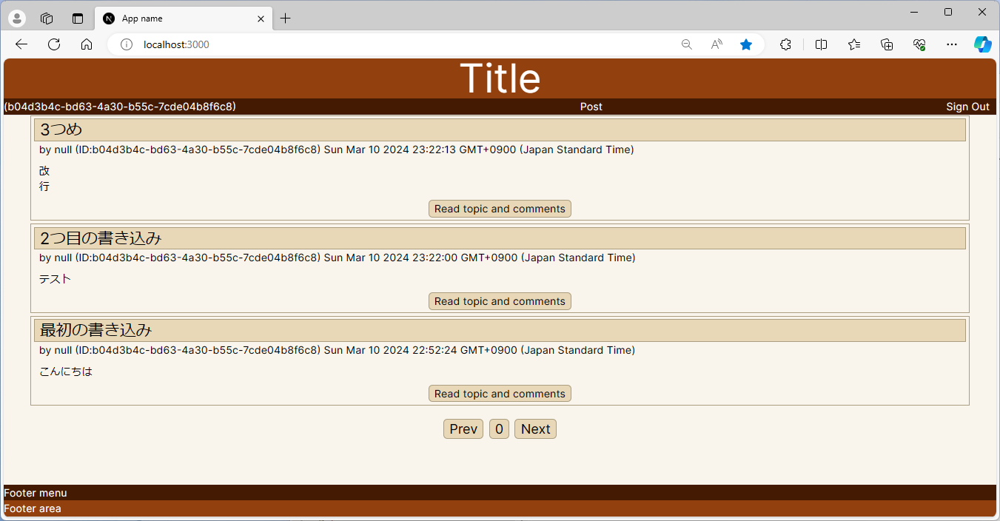
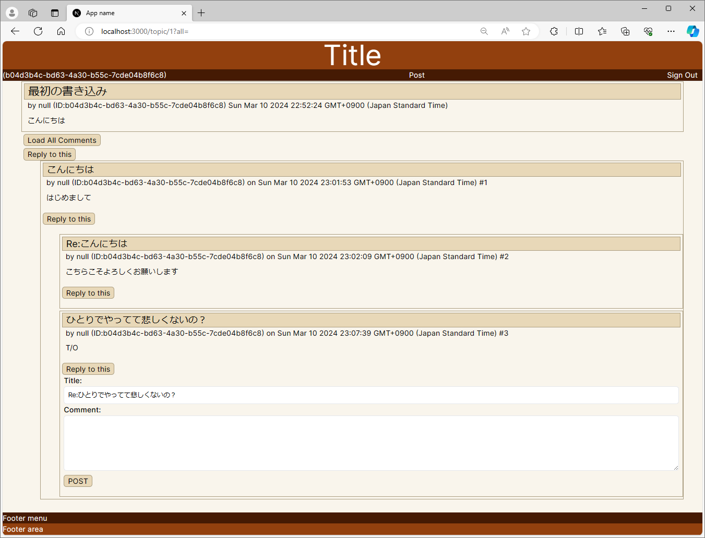

スレッド型のニュースサイトを作ってみようというこころみ。
夢半ばで挫折

Next.js + Prisma(PostgreSQL) + NextAuth の組み合わせ。

## TOP画面
こんな感じ



## コメント画面
こんな感じ




This is a [Next.js](https://nextjs.org/) project bootstrapped with [`create-next-app`](https://github.com/vercel/next.js/tree/canary/packages/create-next-app).

## 実行環境構築

ソースコードを取得

```bash
git clone https://github.com/kitune-san/news-threads.git
cd news-threads
npm install
```

PostgreSQLでデータベースを作成

```bash
createdb -O <username> <database-name>
```

.env.localを開いて編集

```
DATABASE_URL="postgresql://<username>:randompassword@localhost:5432/<database-name>?schema=public"
DATABASE_DIRECT_URL=

AUTH_SECRET= # Linux: `openssl rand -hex 32` or go to https://generate-secret.vercel.app/32

AUTH_GITHUB_ID=<GITHUBから取得>
AUTH_GITHUB_SECRET=<GITHUBから取得>
```

```bash
npx prisma migrate dev
npx prisma generate
```

アプリケーションを実行

```bash
npm run dev
```

## Getting Started

First, run the development server:

```bash
npm run dev
# or
yarn dev
# or
pnpm dev
# or
bun dev
```

Open [http://localhost:3000](http://localhost:3000) with your browser to see the result.

You can start editing the page by modifying `app/page.tsx`. The page auto-updates as you edit the file.

This project uses [`next/font`](https://nextjs.org/docs/basic-features/font-optimization) to automatically optimize and load Inter, a custom Google Font.

## Learn More

To learn more about Next.js, take a look at the following resources:

- [Next.js Documentation](https://nextjs.org/docs) - learn about Next.js features and API.
- [Learn Next.js](https://nextjs.org/learn) - an interactive Next.js tutorial.

You can check out [the Next.js GitHub repository](https://github.com/vercel/next.js/) - your feedback and contributions are welcome!

## Deploy on Vercel

The easiest way to deploy your Next.js app is to use the [Vercel Platform](https://vercel.com/new?utm_medium=default-template&filter=next.js&utm_source=create-next-app&utm_campaign=create-next-app-readme) from the creators of Next.js.

Check out our [Next.js deployment documentation](https://nextjs.org/docs/deployment) for more details.
